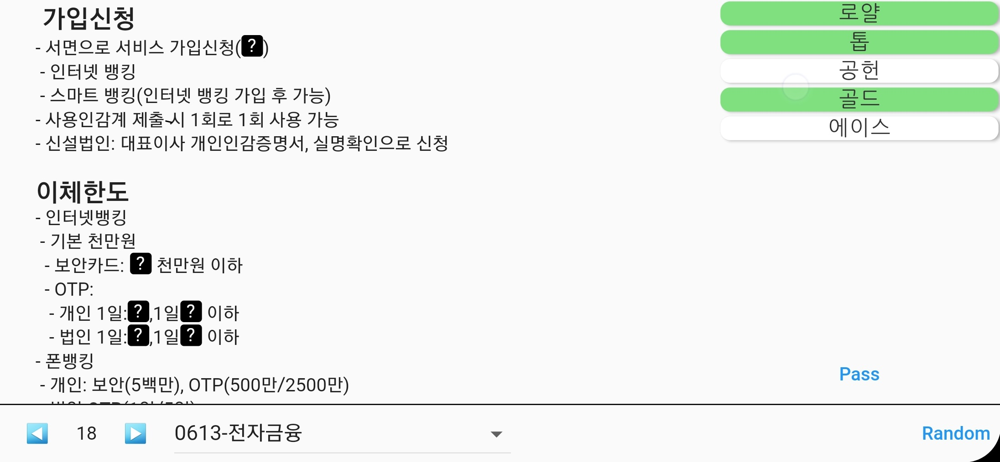

# Rapid Test app

- This app made for the test in Daegu Bank.
- Test file saved in assets so if you want to add test, insert that in asset.
- Test file syntax
 - `# text`: `text` will be show as title
 - `[answer;wrong1;wrong2;wrong3]`: `typing` quiz
 - `{answer1,answer2,answer3}`: `parallel typing` quiz
 - `{number}`: `numeric` quiz
 - `{answer1,answer2;wrong1;wrong2}`: `choice` quiz
 - `{@1st_answer,2nd_answer,3rd_answer;wrong1,wrong2}`: `choice in order` quiz

# Screenshots

▲Typing quiz

▲Parallel typing quiz

▲Numeric quiz

▲Choice quiz

▲Choice in order quiz

